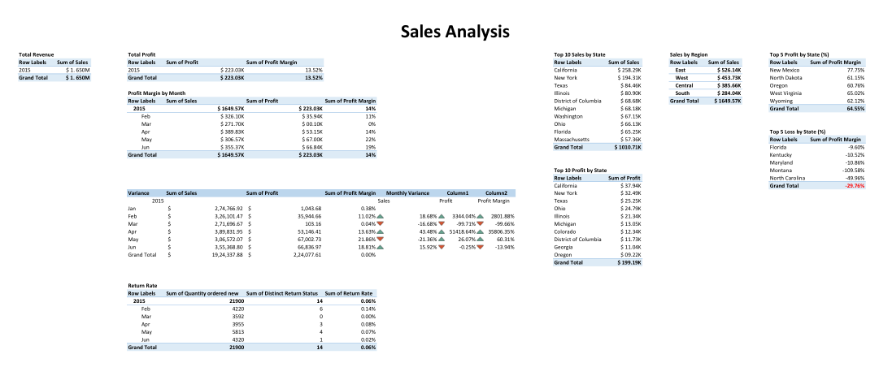
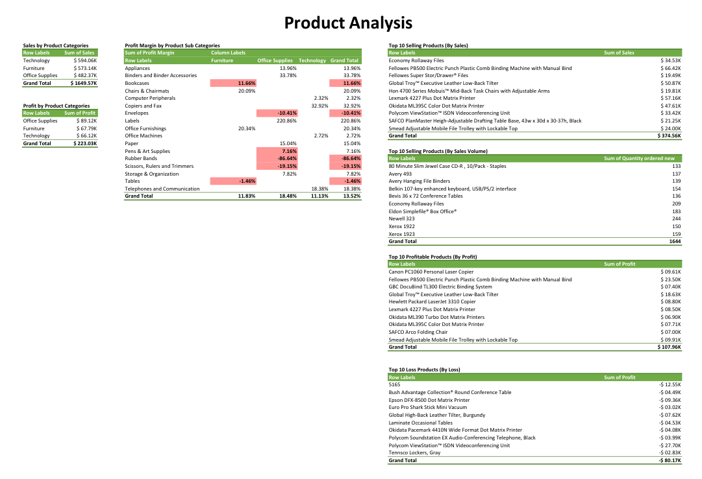
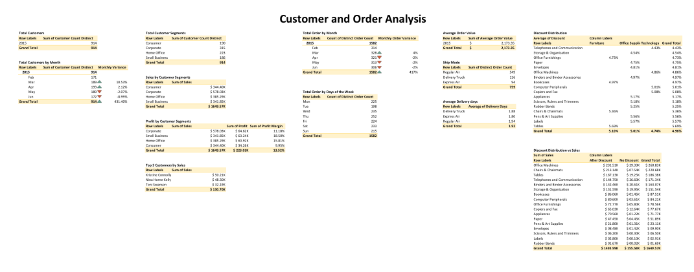
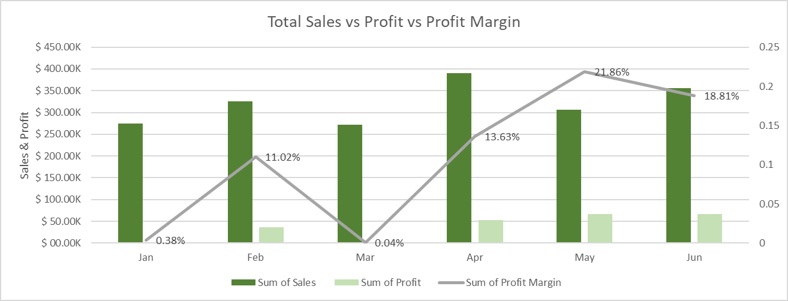
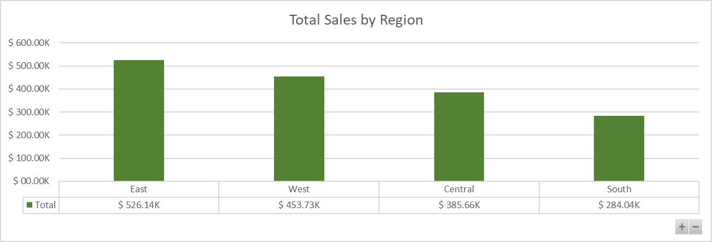
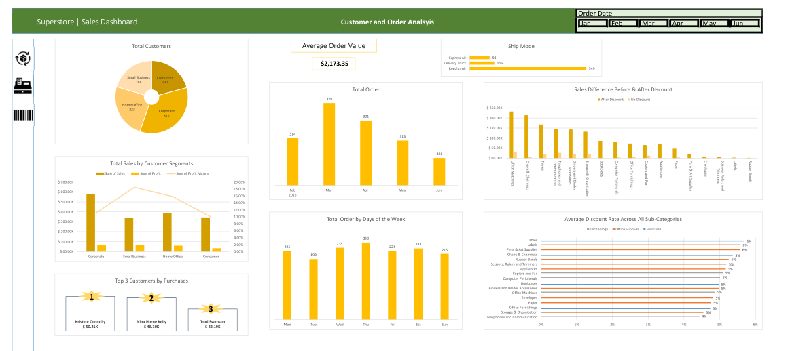
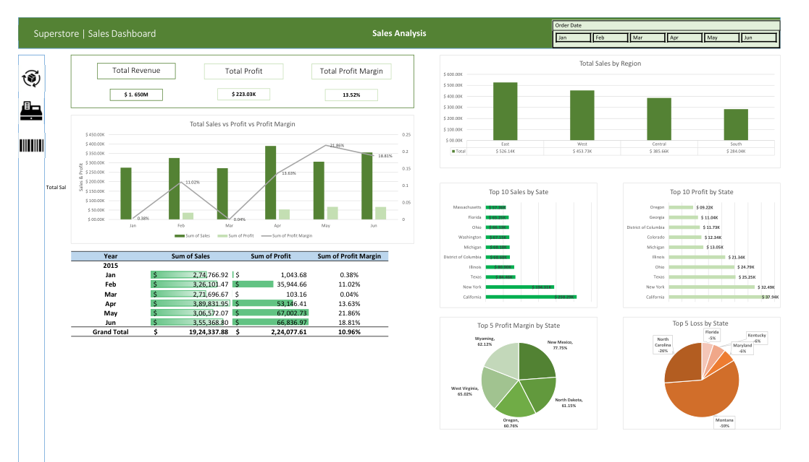
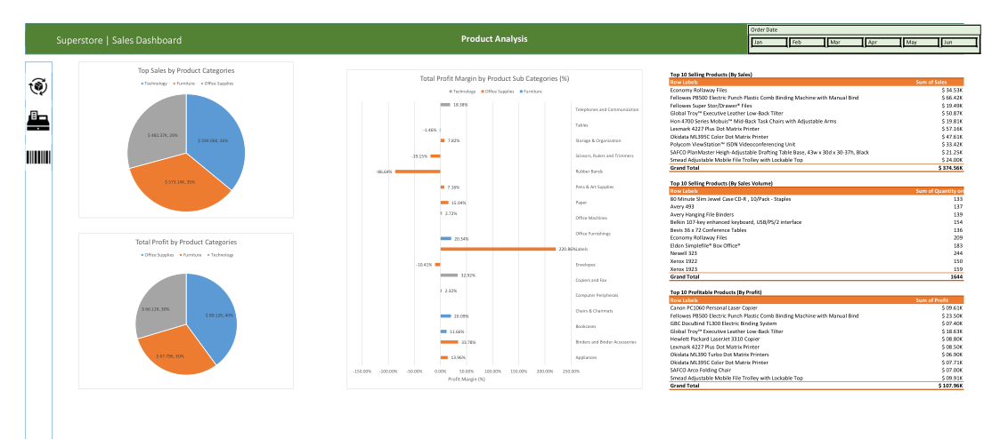

# SuperStore Sales Analysis


# Table of Contents

- [Objective](#objective)
- [Data Source](#data-source)
- [Stages](#stages)
- [Design](#design)
  - [Mockup](#mockup)
  - [Tools](#tools)
- [Development](#development)
  - [Data Exploration](#data-exploration)
  - [Data Cleaning](#data-cleaning)
  - [Transform the Data](#transform-the-data)
- [Testing](#testing)
- [Analysis](#analysis)
- [Visualisation](#visualisation)
- [Recommendations](#recommendations)
  - [Action Plans](#Action_Plans)
  - [Key Performance Indicators (KPIs) to Monitor](#Key_Performance_Indicators_(KPIs)_to_Monitor)


# Objective

The primary objective of this analysis is to derive insights from the Superstore's sales data to answer the following key questions:
1. What is the total revenue generated by the store?
2. Which category of products contributes the most to sales?
3. How has the sales trend been for the past year?
4. Which region has the highest sales and which one has the lowest?
5. What is the average profit margin of the store?

## User Story

As the General Manager, I want to identify the bestselling products and the recent trends, so that I can decide on which products would be best to run marketing campaigns on to generate a good ROI. 


# Data Source

The data for this analysis is sourced from the Superstore Sales dataset, which includes detailed information on orders, returns, users, and various dashboards and pivot tables. The dataset comprises multiple sheets:
- Description and Questions
- Orders
- Returns
- Users

The data is sourced from Kaggle (an Excel extract), [see here to find it](https://www.kaggle.com/datasets/vivek468/superstore-dataset-final)

# Stages

The project is divided into several stages:
1. Data Exploration
2. Data Cleaning
3. Data Transformation
4. Testing
5. Analysis
6. Visualisation
7. Recommendations
8. Conclusion


# Design

## Dashboard components required 
What should the dashboard contain based on the requirements provided?

- What is the total revenue generated by the store?
- Which category of products contributes the most to sales?
- How has the sales trend been for the past year?
- Which region has the highest sales and which one has the lowest?
- What is the average profit margin of the store?

## Mockup

The design phase includes creating mockups to visualize the expected output of the dashboards and reports. Mockups help in understanding the layout and design elements that will be used in the final visualizations.

Some of the data visuals that may be appropriate in answering our questions include:

1. Line Chart
2. Bar Chart
3. Scorecards
4. Pie Chart 


## Tools Used

This project analysis has been conducted entirely within **Excel** to showcase the depth of knowlege with the toold and the expertise.


# Development

## Data Exploration Steps

How can we approach the problem to create a solution from start to finish?

  1. Get the data from a reliable data source
  2. Explore the data in Excel to check for any errors that standout
  3. Create addtional columns using to find the distinct orders, return rate, and distinct return rate
  4. Create pivot tables to summarise customers and order data, sales data and product data
  5. Create pivot charts to visualise the data
  6. Create slicers to ease the navigation through the data
  7. Arrange the visualisation dashboards
  8. Generate the findings based on the insights
  9. Write the documentation + commentary
  10. Publish the insights generated


### Data exploration notes

This is the stage where we scan the data for errors, inconcsistencies, bugs, weird and corrupted characters etc. 

The data exploration stage involves understanding the structure of the raw data. The key findings from each sheet in the SuperStoreUS-2015.xlsx file are summarized below:

1. Orders Sheet: Contains detailed order information including sales, profit, product categories, and customer details.
2. Returns Sheet: Lists the orders that were returned.
3. Users Sheet: Provides information on regional managers.

Additionally the sheets contain the following columsn;

- Row ID
- Order Priority
- Discount
- Unit Price
- Shipping Cost
- Customer ID
- Customer Name
- Ship Mode
- Customer Segment
- Product Category
- Product Sub-Category
- Product Container
- Product Name
- Product Base Margin
- Country
- Region
- State or Province
- City
- Postal Code
- Order Date
- Ship Date
- Profit
- Quantity ordered new
- Sales
- Order ID
- Return Status
- Region
- Manager

What are the initial observations with this dataset? What's caught our attention so far?

1. The dataset includes detailed order information with relevant dates, sales and profit figures. The initial exploration reveales that the quality of the data is high and we have everything we need to perform the analysis.
2. The Returns and Users sheets contains data that can be linked to orders through 'Order ID' and 'Region'.
3. There are some blanks and irregular data that needs to be cleaned before conducting the analysis. 
4. There is a need to calculate the dintinct number of orders and returns.


## Data cleaning 
- What do we expect the clean data to look like? What should it contain? What contraints should we apply to it?

The aim is to refine the dataset to ensure it is structured and ready for analysis. 

The cleaned data should meet the following criteria and constraints:

1. Removing any duplicate entries in the orders IDs
2. Handling any missing values in critical columns like sales and profit

Below is a table outlining the our cleaned dataset:

| Sheet | Number of Rows | Number of Columns |
| --- | --- | --- |
| --- | --- |
| **Orders** | 1952 | 25
| --- | --- |
| --- | --- |
| **Returns** | 1635 | 2 |
| --- | --- |
| --- | --- |
| **Users** | 5 | 2 |


## Transform the data

Before we can begin analysing the data it is necessary to transform the data with a few addtional columns to make it more coherent and usable.

The below additional columns have been created using the formulae shown :

Distinct Customer Count
```sql
=IF(COUNTIF(G$2:G2,G2)=1,"New Customer","Returning Customer")
```

Customer Count Distinct
```sql
=IF(H2="New Customer",1,0)
```

Order Day
```sql
=TEXT(W2,"ddd")
```

Delivery Days
```sql
=Y2-W2
```

Is Discount
```sql
=IF(C2=0,"No Discount","After Discount")
```

Distinct Order Count
```sql
=IF(COUNTIF(AE$2:AE1953,AE2)=1,1,0)
```

Distinct Return Status
```sql
=IF(AG2="Not Returned",0,1)
```

Further to the above additonal columns, a few other columns have been added from other sheets using the **XLOOKUP** formula to amalgamate all the data on a single sheet to ease the analysis process.

- For Example
Return Status
```sql
=XLOOKUP(AE2,Returns!A:A,Returns!B:B,"Not Returned",0,1)
```


# Testing

To ensure the accuracy and reliability of the data, several tests were conducted:

- Row Count Check: Verify the number of records.
- Column Count Check: Ensure all necessary columns are present.
- Data Type Check: Confirm appropriate data types for each column.
- Duplicate Check: Ensure all records are unique.

#### Row Count Check

Checked all rows in column A to ensure the count matches the expected number of records (1952)
Formula Used
```sql
=COUNTA(A:A)
```

#### Column Count Check

Checked all columns in row 1 to ensure all 25 columns and the additional added 9 columns are present 
Formula Used
```sql
=COUNTA(1:1)
```
#### Duplicate Check

- Applied Conditonal Formatting to highlight duplicate values to columns that uniquely identify records, such as Order ID (column AE).
- Verified that there were no duplicate entries.

#### Missing Values Check:

Checked 'Sales', 'Profit' and 'Order Date' columns for any missing values and ensured that these critical fields were filled.
Formula Used
```sql
=ISBLANK(U2)
```


# Analysis

For the analysis we use a range of pivot tables to gain insights around sales, products and customer orders.

Here are the key questions we are looking to answer:
1. What is the total revenue generated by the store?
2. Which category of products contributes the most to sales?
3. How has the sales trend been for the past year?
4. Which region has the highest sales and which one has the lowest?
5. What is the average profit margin of the store?

Here are the calculated fields created to ease the analysis using pivot tables:
##### Profit Margin
```sql
=Profit/Sales
```

##### Average Order Value 
```sql
=Sales/Distinct Order Count
```

##### Return Rate
```sql
=Distinct Return Status/Quantity Ordered New
```

Now that there are all the necessary fields to analyse the data, pivot tables are created to analyse sales, products and customer and order trends. Below are the images of the pivot tables created for each one,
#### Sales Analysis



#### Product Analysis



#### Customer and Order Analysis




Here are the key findings that answer our questions,

### 1. Total Revenue Generated by the Store

| Year | Revenue (in M) |
|---| --- |
| 2015 | $ 1.650M |

### 2. Category of Products that Contibute to Most Sales

| Row Labels | Sum of Sales |
|---|---|
| Technology |	$ 594.06K |
| Furniture |	$ 573.14K |
| Office Supplies |	$ 482.37K |

### 3. Sales Trend 



### 4. Regional Sales 



### 5. Average Profit Margin

| Year | Avg Profit Margin (in %) |
|---| --- |
| 2015 | 14% |


# Visualisation

- What does the dashboard look like?

### Customer and Order Analysis




### Sales Analysis




### Product Analysis




# Recommendations

1. The category contributing the most to sales is **Technology** with sales amounting to $ 594.06K. This indicates a strong market demand for technology products. Ensuring ample stock and focused marketing on these products can maximize revenue.
2. Analyzing the sales trend for the past year reveals seasonal peaks and troughs. There is a significant increase in the revenue generated during the holiday season sales. Planning promotions and inventory accordingly for these peak times can optimize sales.
3. The region with the highest sales is the **East** with $ 526.14K in sales. This region should receive focused marketing and resource allocation to further capitalize on its high performance. Conversely, the "South" region with sales of $ 284.04K indicates potential underperformance. Strategies such as localized promotions or identifying regional preferences could help boost sales.
4. The average profit margin calculated from the data is approximately 10.2%. The pricing startegies and operational efficiency can be further improved to generate more profits.


## Action Plans

### Product Category Focus

- Enhance Inventory for Technology Products:
    - Timeline: Immediate (within 1 month)
    - Responsibility: Inventory Manager
    - Action: Increase stock levels for top-selling technology products to avoid stockouts and meet high demand.

- Focus Marketing Efforts:
    - Timeline: Short-term (within 2 months)
    - Responsibility: Marketing Team
    - Action: Develop targeted marketing campaigns for technology products, highlighting their features and benefits.

- Explore Bundling Options:
    - Timeline: Medium-term (within 3 months)
    - Responsibility: Product Manager
    - Action: Create product bundles that include top-selling technology items with complementary furniture or office supplies to boost sales.


### Sales Trend Optimisation

- Seasonal Promotions for Peak Months
    - Timeline: Immediate (plan within 1 month, execute during peak season)
    - Responsibility: Marketing Team
    - Action: Develop special promotions and discounts for the peak sales month of December to maximize revenue.

- Loyalty Programs for Off-Peak Months
    - Timeline: Medium-term (within 3 months)
    - Responsibility: Customer Relations Team
    - Action: Implement loyalty programs and offer discounts during off-peak months (e.g., January, February) to stabilize sales.

 
### Regional Sales Strategies

- Boost High-Performing Regions (West):
    - Timeline: Short-term (within 2 months)
    - Responsibility: Regional Sales Manager
    - Action: Allocate additional marketing resources and tailor campaigns specifically for the West region to further increase sales.

- Improve Low-Performing Regions (South):
    - Timeline: Medium-term (within 4 months)
    - Responsibility: Regional Sales Manager
    - Action: Conduct market research to understand customer preferences in the South region and develop localized promotions. Improve supply chain efficiencies to reduce costs and improve product availability.


### Profit Margin Improvement

- Cost Reduction Initiatives:
    - Timeline: Immediate and ongoing (start within 1 month)
    - Responsibility: Operations Manager
    - Action: Review and renegotiate supplier contracts to reduce procurement costs. Optimize logistics to minimize shipping costs and improve delivery times.

- Re-evaluate Pricing Strategy:
    - Timeline: Short-term (within 2 months)
    - Responsibility: Pricing Analyst
    - Action: Conduct a thorough analysis of current pricing strategies. Adjust prices to ensure they cover costs and reflect market demand while aiming to improve profit margins.


## Key Performance Indicators (KPIs) to Monitor

1. **Sales Growth**: Measure the percentage increase in sales for technology products and other key categories.
2. **Profit Margin**: Track the improvement in overall profit margin percentage.
3. **Inventory Turnover**: Monitor the rate at which inventory is sold and replaced.
4. **Customer Retention Rate**: Measure the effectiveness of loyalty programs in retaining customers during off-peak months.
5. **Regional Sales Performance**: Compare sales performance across different regions, focusing on improvements in the South region.

Based on our comprehensive analysis, implementing this action plan will yield optimal results for Superstore. Regular reviews are essential to closely assess improvements and determine what strategies are effective. By conducting these reviews, we can identify areas for adjustment and implement necessary tweaks to enhance our processes, ensuring sustained growth and success.


