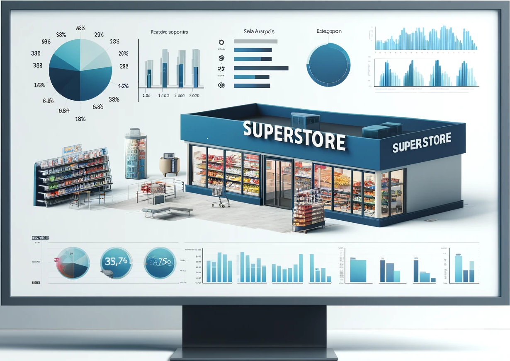
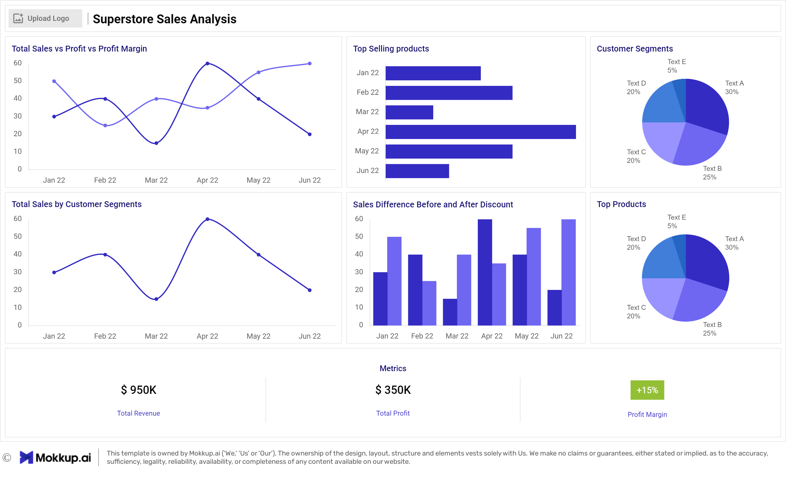

# SuperStore Sales Analysis

# Table of Contents

- [Objective](#objective)
- [Data Source](#data-source)
- [Stages](#stages)
- [Design](#design)
  - [Mockup](#mockup)
  - [Tools](#tools)
- [Development](#development)
  - [Data Exploration](#data-exploration)
  - [Data Cleaning](#data-cleaning)
  - [Transform the Data](#transform-the-data)
- [Testing](#testing)
  - [Data Quality Tests](#data-quality-tests)
- [Visualization](#visualization)
  - [Results](#results)
- [Analysis](#analysis)
  - [Findings](#findings)
  - [Validation](#validation)
  - [Discovery](#discovery)
- [Recommendations](#recommendations)
  - [Potential ROI](#potential-roi)
  - [Potential Courses of Actions](#potential-courses-of-actions)
- [Conclusion](#conclusion)

# Objective

The primary objective of this analysis is to derive insights from the Superstore's sales data to answer the following key questions:
1. What is the total revenue generated by the store?
2. Which category of products contributes the most to sales?
3. How has the sales trend been for the past year?
4. Which region has the highest sales and which one has the lowest?
5. What is the average profit margin of the store?

## User Story

As the Regional Manager, I want to identify the bestselling products and the recent trends, so that I can decide on which products would be best to run marketing campaigns on to generate a good ROI. 

# Data Source

The data for this analysis is sourced from the Superstore Sales dataset, which includes detailed information on orders, returns, users, and various dashboards and pivot tables. The dataset comprises multiple sheets:
- Description and Questions
- Orders
- Returns
- Users

# Stages

The project is divided into several stages:
1. Data Exploration
2. Data Cleaning
3. Data Transformation
4. Testing
5. Visualization
6. Analysis
7. Recommendations
8. Conclusion

# Design

## Dashboard components required 
- What should the dashboard contain based on the requirements provided?

- What is the total revenue generated by the store?
- Which category of products contributes the most to sales?
- How has the sales trend been for the past year?
- Which region has the highest sales and which one has the lowest?
- What is the average profit margin of the store?

## Mockup

The design phase includes creating mockups to visualize the expected output of the dashboards and reports. Mockups help in understanding the layout and design elements that will be used in the final visualizations.

Some of the data visuals that may be appropriate in answering our questions include:

1. Line Chart
2. Bar Chart
3. Scorecards
4. Pie Chart 

## Tools Used

This project analysis has been conducted entirely within **Excel** to showcase the depth of knowlege with the toold and the expertise.

# Development

